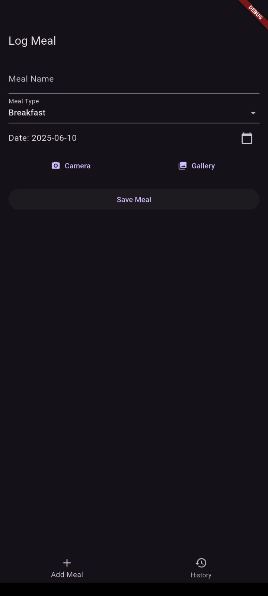

# Simple Meal Tracker - Flutter Assignment

A simple meal tracking mobile application built with Flutter. Allows users to log meals with photos, view meal history, search by meal name, and manage data locally using SQLite. Implements Clean Architecture and uses Riverpod for state management.

## Features

- **Meal Entry**: Log new meals with name, type, date, and photo (camera/gallery).
- **Meal History**: View all logged meals, grouped by date, with thumbnails.
- **Search**: Filter meals by name.
- **Local Storage**: Meals and images are stored locally using SQLite and the device's file system.
- **Architecture**: Clean Architecture pattern with proper separation (data/domain/presentation).
- **State Management**: Riverpod.
- **UI**: Responsive UI with bottom navigation.

## Bonus

- Pull-to-refresh on meal history.
- Dark mode support.
- Unit tests for business logic.

## Getting Started

### Prerequisites

- Flutter SDK (latest stable)
- Dart
- Android/iOS device or emulator

### Packages Used

- `flutter_riverpod`
- `sqflite`
- `path_provider`
- `image_picker`
- `path`
- `intl`

### Setup

1. **Clone this repository:**
    ```bash
    git clone https://github.com/your-username/simple_meal_tracker.git
    cd simple_meal_tracker
    ```

2. **Install dependencies:**
    ```bash
    flutter pub get
    ```

3. **Run the app:**
    ```bash
    flutter run
    ```

### Screenshots

> 
> 

### Sample Data

Some meals are pre-populated for testing on first launch.

---

## Project Structure

```
lib/
├── data/
│   ├── datasources/
│   │   └── meal_local_datasource.dart
│   ├── models/
│   │   └── meal_model.dart
│   └── repositories/
│       └── meal_repository_impl.dart
├── domain/
│   ├── entities/
│   │   └── meal.dart
│   ├── repositories/
│   │   └── meal_repository.dart
│   └── usecases/
│       ├── add_meal.dart
│       ├── get_meals.dart
│       ├── search_meals.dart
│       └── delete_meal.dart
├── presentation/
│   ├── providers/
│   │   └── meal_providers.dart
│   ├── screens/
│   │   ├── meal_entry_screen.dart
│   │   └── meal_history_screen.dart
│   ├── widgets/
│   │   ├── meal_card.dart
│   │   └── meal_form.dart
│   └── main_screen.dart
├── utils/
│   └── image_utils.dart
└── main.dart
```

---

## Notes

- No authentication.
- No network/API dependency.
- Simple, clean UI with focus on functionality and clean code.
- Error handling included for forms and storage.

---

## License

MIT
